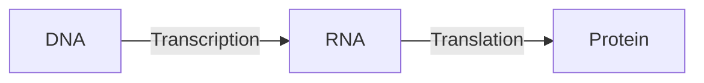
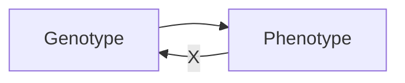

- The information required to build a living organism is coded in it's DNA
- Genotype (DNA inside) determines phenotype (outside)
- The mapping *genes -> phenotypic traits* is very complex
	- one gene may affect many traits (pleiotropy)
	- Many genes may affect one trait (polygeny)
- Small changes in genotype lead to small changes in the organism
	- for example: height, hair color

## Genes and the Genome

- Genes are encoded in strands of DNA called chromosomes
- In most cells, there are two copies of each chromosome (diploid chromosomes)
- The **complete genetic material** in an individual's genotype is called a **genome**
- Within a species, most of the genetic material is the same
- Humans:
	- human genome contains 3 billion DNA base pairs (with 20,000 genes)
	- where 99.9% identical in every person

## Homo sapiens

- Human DNA is organised into chromosomes
- Human body cells contain 23 pairs of chromosomes which together define the physical attributes of the individual

## Reproductive Cells

- Gametes (sperm and egg cells) contain 23 individual chromosomes rather than 23 pairs
- Cells with only one copy of each chromosome are called haploid
- Gametes are formed by a special form of cell splitting called meiosis
- During meiosis the pairs of chromosome undergo an operation called crossing-over
- Note: biologists use “crossing-over”, EC folks use “crossover”

## Crossing-over during meiosis

- Chromosome pairs align and duplicate
- Inner pairs link at a centromere and swap part of themselves
- Outcome is one copy of material/paternal chromosome plus two entirely new combinations
- After crossing-over one of each pair goes into each gamete

## Mutation

- Occasionally some of the genetic matrial changes very slightly during cross-over (replication error)
- This means that the child might have genetic material information not inherited from either parent
- This can be:
	- catastrophic: offspring is not viable (most likely)
	- neutral: new feature does not influence fitness
	- advantageous: strong new  feature occurs
- Redundancy in the genetic code forms a good way of error checking

## Fertilization

![[Fertilisation_img.png]]

## After Fertilization

- New zygote rapidly divides creating many cells all with the same genetic contents
- Although all cells contain the same genes, depending on, for example where they are in the organism, they will behave differently
- This process of differential behavior during development is called **ontogenesis**
- All of this uses, and is controlled by, the same mechanism for decoding the genes in DNA

## Genetic Code

- All proteins in living beings on earth are composed of sequences built from 20 different amino acids
- DNA is built from four nucleotides in a double helix spiral: purines A,G; pyrimidines T,C
- Triplets of these form codons, each of which codes for a specific amino acid
- Much redundancy:
	- purines complement pyrimidines
	- the DNA contains much rubbish
	- 43=64 codons code for 20 amino acids
	- genetic code = the mapping from codons to amino acids
- For all natural life on earth, the genetic code is the same!

## Transcription, translation

A central claim in molecular genetics: only one way flow

[[Lamarckism]] (saying that acquired features can be inherited) is thus wrong!
But we can use it in artificial evolution!