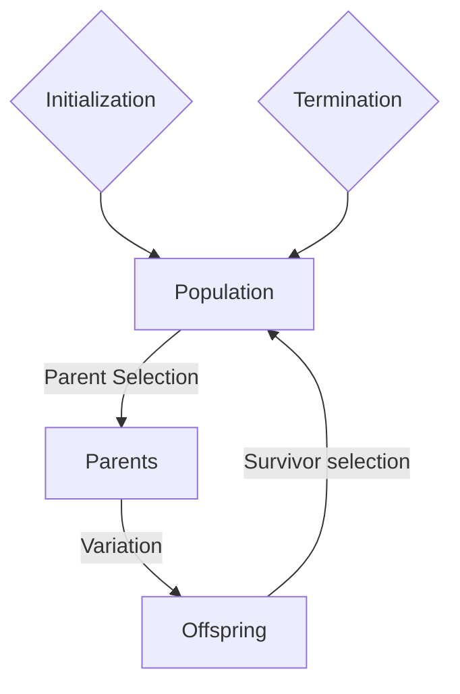

### Pseudo-code
```
BEGIN
	INITIALISE population with random candidate solutions;
	EVALUATE each candidate;
	REPEAT UNTIL (TERMINATION CONDITION is satisfied) 
		DO
			1.SELECT parents;
			2.RECOMBINE pairs of parents;
			3.MUTATE the resulting offspring;
			4.EVALUATE new candidates;
			5.SELECT individuals for the next generation;
		OD
END
```

