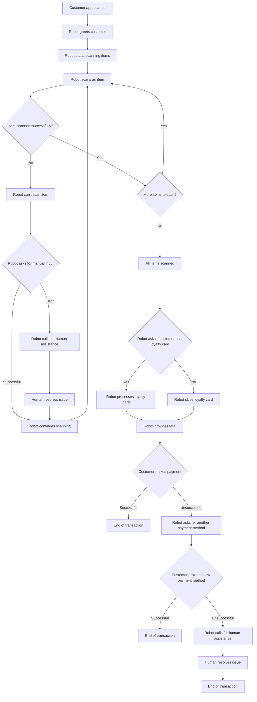

# Human-robot interaction
The diagram below represents a typical interaction between a customer and a robot in a grocery store checkout scenario. It outlines the process from the moment the customer approaches the checkout to the completion of the transaction. The diagram includes various paths based on different situations such as successful scanning of items, loyalty card processing, and payment methods. It also incorporates error handling and fallback mechanisms for scenarios like scanning errors and payment failures. The flow ensures a smooth and efficient checkout experience for the customer while effectively managing potential issues.

